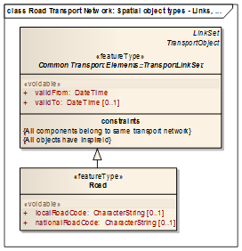
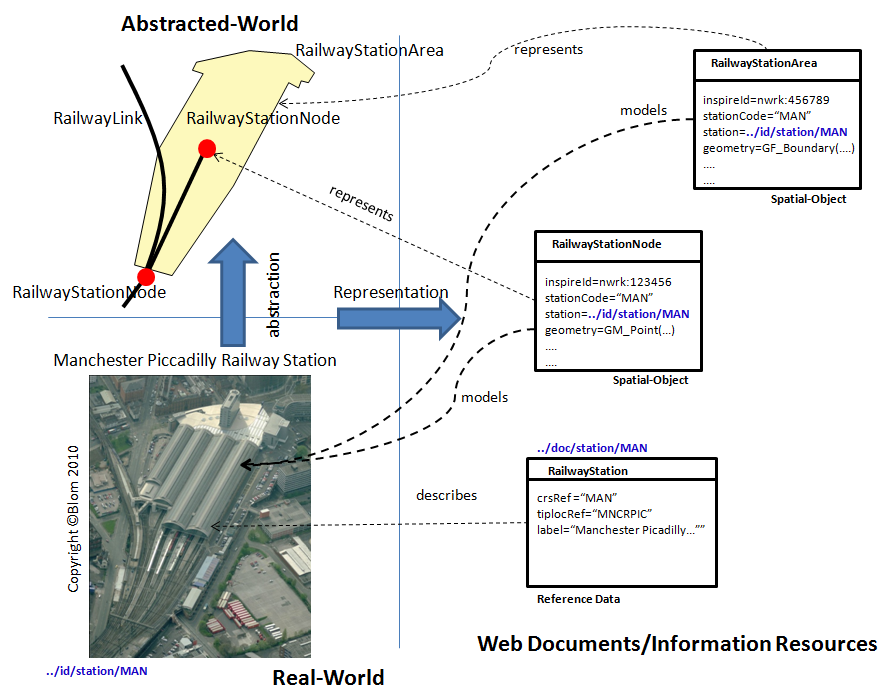
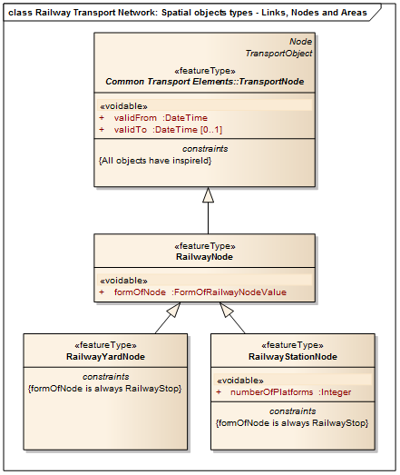
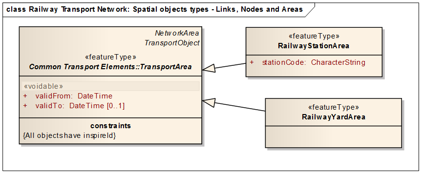
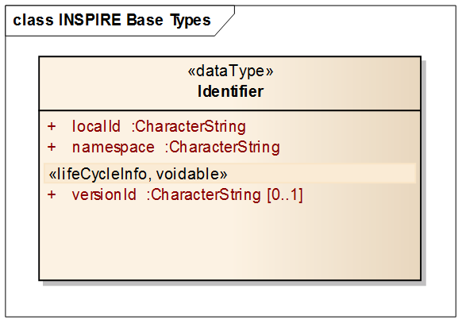
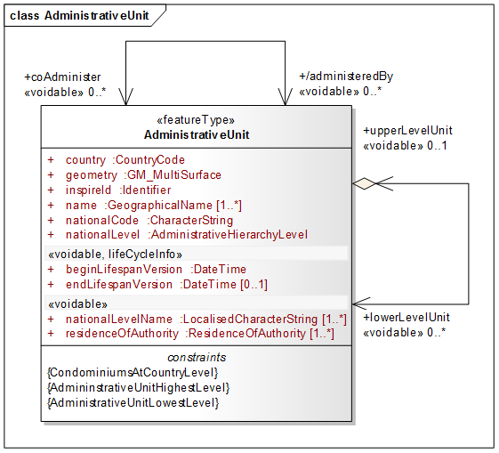
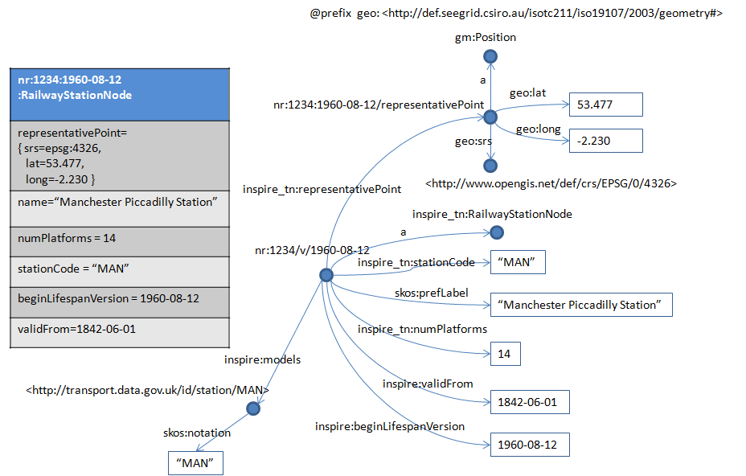

URI for Location

v0.2

7th November 2013

**Editor**: Stuart Williams (skw@epimorphics.com)

**Drafted by: **the UK Government Linked Data Working Group (UKGovLD), including representatives from public-sector departments, agencies and local government, linked-data businesses and the broader linked-data community. 

_This document will be updated through any outcomes of the [standards.data.gov.uk](http://standards.data.gov.uk) process and published within the UKGovLD section of [data.gov.uk](http://data.gov.uk/linked-data) in February 2014.  Issues can be raised and versioning will be controlled through the [UKGovLD Github repositories](https://github.com/UKGovLD/)_
_Please also see [URI Patterns core](https://github.com/UKGovLD/URI-patterns-core) for the generic patterns guidance referenced from this document_

# Introduction

## Background

The EU INSPIRE Directive calls for:

"a common framework for the unique identification of spatial objects, to which identifiers under national systems can be mapped in order to ensure interoperability between them"

It goes on to defined a spatial object as:

"... an abstract representation of a real-world phenomenon related to a specific location or geographical area"[3]

This paper is focussed on the use of http[s] URI by the UK public sector to meet its INSPIRE objectives.

This paper updates the URI patterns provided in earlier guidance [2] in line with changes proposed for the general use of URI patterns for data publishing within the UK public sector [1] and making use of changes in INSPIRE that allow full URI to be used as INSPIRE namespaces (NOTE:  Previously character restrictions on the 'spelling' of INSPIRE namespaces prevented URI in general and HTTP URI in particular from being used as INSPIRE namespaces.).

## INSPIRE Spatial Objects

INSPIRE spatial-objects are "... an abstract representation of a real-world phenomenon related to a specific location or geographical area". Typically this means that they are information objects that generally have one or more associated geometries, referenced to a particular coordinate reference system. Spatial applications in general uses many more coordinate reference systems that the commonly used WGS-84 (aka EPSG:4326) that will be familiar to users of GPS. In the UK people are commonly aware of the Ordnance Survey National GRID (aka OSGB-36 or EPSG:27700).

INSPIRE documents discuss three forms of identifiers:

* unique object identifiers

* thematic identifiers

* geographic identifiers

**Unique object identifiers** are identifiers that can be used to make external (NOTE:  i.e. references to objects within a dataset from outside of that dataset.) references to INSPIRE spatial objects. They are made up of three components:

**namespaceId**	divides the space of unique object identifiers into partitions that can be administered by different data publishers. INSPIRE delegates the assignment of INSPIRE namespace identifiers to member-states. Recent changes mean that it is now possible to use a URI as an INSPIRE namespace identifier.

**localId**	The localId of a spatial-object within a namespace. Distinguishes one spatial-object from another within namespace.

**versionId**	Identifies the version of a spatial-object. This may be as part of the objects presentation simple as a means to indicate change or as a means to identify specific object versions in systems that maintain object history. Object versioning and change is discussed further in "Annex II Things, Spatial-Objects and Versions".

**Thematic identifiers** are typically conveyed as coded attributes of a spatial object, for example a railway station or airport code from a reservation system, or a waterbody identifier from a catchment planning system. When given or available they 'identify' the real-world phenomena for which the spatial-object is abstract representation. Ideally thematic identifiers where available should be used to form URI for the real-world phenomena to which they pertain. They provide away of associating multiple spatial-objects that pertain to the same real-world phenomena. See xxx

**Geographic identifiers**: the INSPIRE Generic Conceptual Model [4] defines geographical identifiers as:

"spatial reference in the form of a label or code that identifies a location" 

and gives place names and post codes as examples of geographic identifiers. Geographic identifiers may be spatial-objects in their own right, for example Addresses under INSPIRE Annex I or property based references to entries in a gazetteer. They are not discussed further in this document.

## location.data.gov.uk

**http://location.data.gov.uk** was established under the earlier guidance [2] has two primary roles:

1. as a base URI for the identification of INSPIRE spatial-objects 

2. as a base URI for the publication of linked-data vocabulary derived from INSPIRE application-schema.

The first of these roles is deprecated by this revision. 

However, the role of location.data.gov.uk in the publication of linked-data vocabularies derived from INSPIRE data specifications continues until equivalent vocabularies are published and supported by the wider INSPIRE initiative.

### Revision of URI patterns for identifying Spatial-Objects

The URI patterns promoted in earlier guidance [2] embed INSPIRE spatial-object within an http URI based at **http://location.data.gov.uk/**. The character constraints on the external identifiers for INSPIRE spatial-object identifiers were such that, while they could not themselves be URI, they could be embedded within URI path segments:

**`http://location.data.gov.uk/so/{theme}/{class}/{inspireNamespaceId}/{inspireLocalId}[/{inspireVersionId}**]`

The **_{theme}_** and **_{class}_** fields provide human oriented 'hints' about the kind of spatial-object referenced by a URI, but identification of the spatial-object itself is the role of the three trailing 'id' fields.

Spatial-object publication could be hosted directly at location.data.gov.uk, but more typically, redirection or proxy based access was configured so that access requests are routed to infrastructure provided by the data publisher. 

This original pattern for publishing INSPIRE spatial-objects is awkward in practice, firstly because in order to correctly form a URI for a spatial-object there is a need to know not only it's external object identifier (**_namespaceId_**, **_localId_** and **_versionId_**) but also the INSPIRE data specification class name and theme associated with the object being published; and secondly publications of spatial-objects in location.data.gov.uk URI space separates elements that might easily form a more cohesive single collection e.g. sampling points (NOTE:  http://location.data.gov.uk/so/ef/SamplingPoint/bwsp.eaew) from their related bathing-waters (NOTE:  http://environment.data.gov.uk/id/bathing-water) and sample assessment data (NOTE:  http://environment.data.gov.uk/data/bathing-water-quality).

The character constraints associated with the components of an INSPIRE spatial-object identifiers have been relaxed.It is now possible to use URI, particularly dereferencable URI such as an HTTP or HTTPS URI, as INSPIRE namespace identifiers. 

Given this change, there is no longer a need for **http://location.data.gov.uk **to serve as the base URI for spatial-object publication. Instead the left hand part of a URI assigned for a spatial-object can serve the role of an INSPIRE namespace identifier (see section "URI based INSPIRE namespaces" below). In this way spatial-objects can be published as part of a data collection using URI patterns aligned with the common guidance [1].

**`http://{domain}{/collection*}[/so][/{class}]/{inspireLocalId}[/{inspireVersionId}**]`

The use of **location.data.gov.uk** as base URI for the publication of INSPIRE spatial objects is **deprecated** by this revision. However, earlier URI pattern continues to be supported in order to support existing use.

New spatial-object publications are encouraged to use absolute http(s): URI as the INSPIRE namespace identifier component of an INSPIRE spatial-object's external identifier.

## Pattern Notation

In order to capture and present URI patterns, some notation for writing them down is required.

The pattern notation used in this document is based on the "URI Template" specification defined in[ RFC6570](http://tools.ietf.org/html/rfc6570). 

Curly braces, ie. ‘{‘ and ‘}’ are used it introduce template variable expression per [RFC6570](http://tools.ietf.org/html/rfc6570). In addition: we use matched square brackets, ie  ‘[‘ and ‘]’ are used to introduce optional components and a star, ie ‘*’ following such bracket components allows arbitrary repetition (zero or more times) of the group matched by the immediately preceding closing square bracket. Other characters outside of matched curly braces or square brackets represent literal characters to be matched.

In RFC6570, a variable expression such as:

**{/collection*}**

when expanded with a variable binding of:

**collection=("seg1",”seg2”,”seg3”) ** 

contributes the multi-segment component

**"/seg1/seg2/seg3"**

in the corresponding position of the resulting URI. From a URI parsing point-of-view we take such an expression to parse an arbitrary number of path segments into an array valued variable. Given the somewhat general nature of the patterns that follow there are several possible parsings of URI into bindings for any matching URI. However, the patterns presented here as a means to provide some guidance. Actual deployments will make more limiting choices than these somewhat open patterns allow.

## References

[1]	"URI Patterns v0.4" 
[http://tinyurl.com/UKGovLD-revisedUriPatterns](http://tinyurl.com/UKGovLD-revisedUriPatterns) (temporary)

[2]	"Designing URI Sets for Location" 
[http://data.gov.uk/library/designing-uri-sets-for-location](http://data.gov.uk/library/designing-uri-sets-for-location)

[3]	INSPIRE Glossary 
[https://inspire-registry.jrc.ec.europa.eu/registers/GLOSSARY](https://inspire-registry.jrc.ec.europa.eu/registers/GLOSSARY)

[4]	INSPIRE Generic Conceptual Model
[http://inspire.jrc.ec.europa.eu/documents/Data_Specifications/D2.5_v3.4rc3.pdf](http://inspire.jrc.ec.europa.eu/documents/Data_Specifications/D2.5_v3.4rc3.pdf)

[5]	"Formalization of Application Schemas" Simon Cox, CSIRO
[https://www.seegrid.csiro.au/wiki/AppSchemas/SchemaFormalization](https://www.seegrid.csiro.au/wiki/AppSchemas/SchemaFormalization)

[6]	ISO 19103: 2005 	"Geographic information -- Conceptual schema language"

[7]	ISO 19109:2005 	"Geographic information -- Rules for application schema"

[8]	ISO 19150-1:2012	"Geographic information — Ontology — Part 1: Framework"

[9]	ISO/DIS 19150-2	"Geographic information -- Ontology -- Part 2: Rules for developing ontologies in the Web Ontology Language (OWL)"

[10]	"GeoSPARQL - A Geographic Query Language for RDF Data", Open-Geospatial Consortium (OGC)
[http://www.opengeospatial.org/standards/geosparql](http://www.opengeospatial.org/standards/geosparql)

## Glossary

<table>
  <tr>
    <td>Term</td>
    <td>Definition</td>
    <td>Source</td>
  </tr>
  <tr>
    <td>Spatial Object</td>
    <td>an abstract representation of a real-world phenomenon related to a specific location or geographical area
NOTE This INSPIRE term is synonymous with the ISO 19100 term "(geographic) feature", and distinct from ISO "spatial object", which specifically contains the positional information for a feature.</td>
    <td>INSPIRE Glossary item 67</td>
  </tr>
  <tr>
    <td>Spatial Thing</td>
    <td>"Anything with spatial extent, i.e. size, shape, or position. e.g. people, places, bowling balls, as well as abstract areas like cubes."
Spatial-Things are that subset of 'real-world phenomena' which relate to a location.</td>
    <td>W3C “WGS84 Geo Positioning: an RDF vocabulary”</td>
  </tr>
  <tr>
    <td>Unique Object Identifier</td>
    <td>identifier associated with a spatial object</td>
    <td>INSPIRE Glossary Item 77</td>
  </tr>
  <tr>
    <td>Thematic Identifier</td>
    <td>descriptive unique object identifier applied to spatial objects in a defined information theme
EXAMPLE an administrative code for administrative area spatial objects in the administrative units theme, a parcel code for parcel spatial objects in a cadastral theme</td>
    <td>INSPIRE Glossary item 73</td>
  </tr>
  <tr>
    <td>Geographic Identifier</td>
    <td>spatial reference in the form of a label or code that identifies a location [ISO 19112]
EXAMPLE 1 Place names: Paris, Rhine, Mont Blanc
EXAMPLE 2 Postal codes: 53115, 01009, SW1, IV19 1PZ</td>
    <td>INSPIRE Glossary item 32</td>
  </tr>
  <tr>
    <td>URI Set</td>
    <td>a collection of reference data published using
URIs, about a single concept, governed from a single source.</td>
    <td>“Designing URI Sets for the UK Public Sector”</td>
  </tr>
  <tr>
    <td>Web Representation</td>
    <td>Web representation is typically carried in the entity body of an HTTP protocol message. It generally has an associate internet media-type.</td>
    <td></td>
  </tr>
</table>

# Revised Generic URI Patterns

The revised URI pattern guidance [1] a defines a common left-hand side URI pattern of:

`{prefix} = http://{domain}{/collection*}`

along with a collection of right-hand side patterns for: URI Sets; Reference Items (members of URI sets) and their reference documents; vocabularies and vocabulary terms; data sets and data items. These patterns are summarised below and discussed in more detail in [1]

<table>
  <tr>
    <td></td>
    <td>Pattern</td>
  </tr>
  <tr>
    <td>URI Sets</td>
    <td>{prefix}/id/{concept} or 
{prefix}/{concept}#id</td>
  </tr>
  <tr>
    <td>Identifier URI
(for reference items)</td>
    <td>{prefix}/id[/{concept}/{key}]* or 
{prefix}[/{concept}/{key}]*#id</td>
  </tr>
  <tr>
    <td>Document URI
(for reference data)</td>
    <td>reference data for single reference items:
{prefix}/doc[/{concept}/{key}]* or 
{prefix}[/{concept}/{key}]*
optionally, reference data for lists of reference items
{prefix}/doc/{concept}/{key}]*/{concept} or 
{prefix}[/{concept}/{key}]*/{concept}</td>
  </tr>
  <tr>
    <td>Vocabulary URI
(for vocabularies, ontologies, concept schemes, codelists and schema)</td>
    <td>{prefix}/def{/vocabulary*}</td>
  </tr>
  <tr>
    <td>Vocabulary Term URI
(for term definitions within a vocabularies, ontologies, concept schemes, codelists and schema)</td>
    <td>{prefix}/def{/vocabulary*}/{term} or 
{prefix}}/def{/vocabulary*}#{term}</td>
  </tr>
  <tr>
    <td>Dataset URI
(for datasets)</td>
    <td>{prefix}/data{/dataset*}</td>
  </tr>
  <tr>
    <td>Data Item URI
(for data items within datasets).</td>
    <td>{prefix}/data{/dataset*}[/{concept}/{key}]*</td>
  </tr>
</table>

The revised guidance at [1] deferred detailing URI patterns for INSPIRE spatial-objects to this document.

## URI Patterns for INSPIRE Spatial-Objects

### URI based INSPIRE namespaces

From the generic pattern [1]:

`{prefix} = http://{domain}{/collection*}`

and INSPIRE namespace identifier is formulated as:

`{inspireNamespaceUri} = {prefix}[/so][/{class}]`

resulting in URI for INSPIRE spatial objects of the form:

`{inspireNamespaceUri}/{localId}[:{versionId}] or
{inspireNamespaceUri}/{localId}[/{versionId}] or
{inspireNamespaceUri}/{localId}[/version/{versionId}]`

ie. an overall pattern of:

`http://{domain}{/collection*}[/so][/{class}]}/{localId}[:{versionId}] or
http://{domain}{/collection*}[/so][/{class}]}/{localId}[/{versionId}] or 
http://{domain}{/collection*}[/so][/{class}]}/{localId}[/version/{versionId}] or `

Editorial Note: Ideally we need to resolve on a single pattern for combining **_{localId}_** and **_{versionId} _**for those cases where {versionId) is used. The ../version/.. gives more natural points for truncated URI to list available versions, while the ':' formulation is more succinct and restricts the {*localId}:{versionId}* combination to a single URI path segment.

### Non-URI INSPIRE Namespaces

Earlier guidance [2] provided for the mapping of non-URI based INSPIRE namespace identifiers URI space as follows:

`{inspireNamespaceUri} = http://location.data.gov.uk/so/{theme}/{class}/{inspireNamespaceId}`

Existing URI that use this pattern continue to be supported, however its use for new deployments it is **deprecated** either in favour of URI based INSPIRE namespaces (see previous section) or the following patterns which better aligns with the collection based approach of the revised URI patterns [1].

`{inspireNamespaceUri} = http://location.data.gov.uk/{inspireNamespaceId}/so[/{theme}][/{class}]`

Here **_{inspireNamespaceId}_** serves the role of a **_{/collection*}_** in the **_{prefix} _**component of the generic pattern. The rest of the pattern then follows from the URI based patterns of the previous section:

ie. an overall pattern of:

`http://location.data.gov.uk/{inspireNamespaceId}[/so][/{theme}][/{class}]/localId}[:{versionId}] or
http://location.data.gov.uk/{inspireNamespaceId}[/so][/{theme}][/{class}]/{localId}[/version/{versionId}]`

Note that **_{theme}_** and **_{class}_** components are made optional, whilst the contribute useful 'hints' to users about the kind of object being referenced, they do not contribute to its identity which is based on the **_inspireNamespaceId_**, **_localId_** and **_versionId_** fields of an INSPIRE spatial object identifier.

### Indirect or Proxied Access to Spatial-Objects

The collection based approach to URI Patterns, presented in [1], is motivate by a need to provide persistent URI for vocabulary, reference data and reference items ('things') within a shared URI spaces whilst at the same time enabling different data publishers to provide their own publishing infrastructure located elsewhere in URI space. Commonly available redirection or proxying infrastructure can be used to route requests made via published URIs conforming to the patterns in this document and its companion [1] to infrastructure associated with a particular collection. The key to this is the left hand URI pattern in [1] which seeks to formulate the 'key' for a redirection or proxy a simple prefix:

`{prefix} = http://{domain}{/collection*}`

Redirection or proxying access requests is then accomplished by prefix substitution. This works for both non-URI INSPIRE namespaces using the revised pattern for spatial-object URI where the prefix to be matched is:

`http://location.data.gov.uk/{inspireNamespaceId}`

and for URI based INSPIRE namepaces that make use of the common *{prefix}* pattern above, i.e:

`{prefix} = http://{domain}{/collection*}`

Requests using non-URI INSPIRE identifiers, which when mapped to URI have a prefix of the form:

`{prefix} = http://location.data.gov.uk/so/{theme}/{class}/{inspireNamespaceId}`

can be routed on the basis of the **_{inspireNamespaceId} _**(ie. 4th) segment of the request URI.

## URI Patterns for Spatial Things

Spatial-things are the real-world phenomena that spatial-objects are an abstract representation of. Within INSPIRE, thematic references made by a coded property value using, for example, an airport or railway station code, are a way of establishing a relationship between a spatial-object and the 'thing' that it represents. Unfortunately, the INSPIRE data specification do not identify the attributes that carry thematic references in a systematic way. See "Annex I: Thematic Referencing in INSPIRE" for examples of thematic referencing present in INSPIRE Annex 1 themes.

Where possible, thematic references should be reconciled and resolved to an Identifier URI for an existing reference item (see [1] or "Revised URI Patterns" above).

In cases where no-such commonly used Identifier URI (or URI Set) are available, it is preferable that at least a minimal representation of a URI Set corresponding to the reference items (real-world phenomena) is created as part of the published data collection. Such minimal representations should contain a label (**_skos:prefLabel_**) in one or more languages, a notation (**_skos:notation_**) or sub-property thereof bearing the coded value of the thematic reference, an RDF type (common to members of the URI Set) and optionally a descriptive comment (**_rdfs:comment_**) intended to communicate clearly what 'thing' is being referenced to human consumer of the data. Ideally such URI Sets should be published using persistent URI maintained by an authoritative source, however, that is not aways possible.

When a URI Sets needs to be created by a non-authoritative sources as part of a data publication

`	{prefix}/id[/{concept}]/{codeset}/{codepoint}`

which fully expands to either:

* For http[s] URI based INSPIRE namespaces:
`http://{domain}{/collection*}/id[/{concept}]/{codeset}/{codepoint}`

* For non-URI based INSPIRE namespaces :
`http://location.data.gov.uk/{inspireNamespaceId}/id[/{concept}]/{codeset}/{codepoint} or
http://location.data.gov.uk/id/{theme}/{concept}/{codeset}/{codepoint}
`For collection based or legacy **_location.data.gov.uk_** URI patterns respectively

The use of URI based INSPIRE namespace is preferred over the deprecated use of non-URI based INSPIRE namespaces (with collection based prefixing preferred over legacy patterns).

## URI Patterns for INSPIRE derived Vocabulary Terms

INSPIRE data specifications (NOTE:  http://inspire.jrc.ec.europa.eu/index.cfm/pageid/2) are defined as ISO 19103 [6] and ISO 19109 [7] application schema. ISO 19150 [8,9] provides rules for deriving OWL vocabularies (ontologies) from the corresponding application scheme. In general, ISO19150 part 2 [9] maps:

<table>
  <tr>
    <td>From
ISO Construct</td>
    <td>To
OWL Construct</td>
    <td>URI Pattern</td>
  </tr>
  <tr>
    <td>Application Schema</td>
    <td>OWL Ontology</td>
    <td>For vocabularies derived from INSPIRE data specifications:
{ontologyName} = http://location.data.gov.uk/inspire/{theme}/def[/{umlPackageName}]
"inspire/{theme}" serves the role of a {/collection*} name while {umlPackageName} serves the role of {vocabulary}
For vocabularies derived from local application schema

{ontologyName} = http://{host}[/{collection}*]/def/{umlPackageName}
Such schema arise where there is a need to specialise or extend the common INSPIRE application schema.</td>
  </tr>
  <tr>
    <td>Feature Type</td>
    <td>OWL Class</td>
    <td>{ontologyName}('#'|'/'){umlClassName}</td>
  </tr>
  <tr>
    <td>Association</td>
    <td>OWL ObjectProperty</td>
    <td>{ontologyName}('#'|'/')[{umlClassName}.]{umlAssociationRoleName}</td>
  </tr>
  <tr>
    <td>Attribute</td>
    <td>OWL Object or Datatype Property</td>
    <td>{ontologyName}('#'|'/')[{umlClassName}.]{umlAttributeName}</td>
  </tr>
  <tr>
    <td>Codelist</td>
    <td>SKOS ConceptScheme,SKOS Concept subclass, and instances</td>
    <td>{ontologyName}('#'|'/'){umlClassName}.scheme
{ontologyName}('#'|'/'){umlClassName}
{ontologyName}('#'|'/')[{umlClassName}.[cp.]]{umlCodePointName}

Note ISO 19150-2 is a work in progress. It does not currently dictate a particular way to distinguish scheme from class from codepoint.</td>
  </tr>
  <tr>
    <td>Enumeration</td>
    <td>An OWL oneOf enumerated data range.</td>
    <td>{ontologyName}#{umlClassName}
            a   rdfs:Datatype
            owl:oneOf ( "{enum1}" "{enum2}" ... "{enumN}" ) .

Where {enum1} to {enumN} correspond to the literal names of the members of the enumeration.</td>
  </tr>
</table>

Note: ISO 19150-2 has a mild bias toward the use of '#' as a separator between the local part of a URI and its remainder. Both '#' and '/' are generally acceptable separators for such purposes - hence *`('#' |'/'*)` in the patterns above.

Note: for attributes and associations the approach of qualifying an attribute name or association role name with the name of the UML class for which its use is defined is there a need to disambiguate multiple local uses of the same attribute/association role name by different classes within the same package (i.e. ontology). Where a given property/role name is either used only once within a package or where all uses within a package are consistent in the sense of having a common range constraint (or a range constraint that can be generalised) then such qualification is unnecessary.

Note: application schema can import other application schema and/or elements of the ISO 19xxx series Harmonised Model. The package names associated with properties are the package name/application-schema name, is the one in which the property is defined. In order to share property use across the widest possible scope they should be introduced at a sufficiently high level within the combined schema's class hierarchy.

The table below illustrate the application of these patterns to the creation of link-data vocabulary terms for the **Road **feature type of the "Road Transport Network" application schema.

<table>
  <tr>
    <td>URI</td>
    <td>Description</td>
  </tr>
  <tr>
    <td>http://location.data.gov.uk/inspire/tn/def/common-transport-elements/TransportLinkSet</td>
    <td>TransportLinkSet featureType</td>
  </tr>
  <tr>
    <td>http://location.data.gov.uk/inspire/tn/def/road-transport-network/Road</td>
    <td>Road featureType</td>
  </tr>
  <tr>
    <td>http://location.data.gov.uk/inspire/tn/def/road-transport-network/localRoadCode</td>
    <td>localRoadCode property of a Road feature</td>
  </tr>
  <tr>
    <td>http://location.data.gov.uk/inspire/tn/def/road-transport-network/nationalRoadCode</td>
    <td>nationalRoadCode property of a Road feature</td>
  </tr>
  <tr>
    <td>http://location.data.gov.uk/inspire/common/def/inspire/validFrom</td>
    <td>INSPIRE wide reusable validFrom property</td>
  </tr>
  <tr>
    <td>http://location.data.gov.uk/inspire/common/def/inspire/validTo</td>
    <td>INSPIRE wide reusable validTo property</td>
  </tr>
  <tr>
    <td>http://location.data.gov.uk/inspire/common/def/inspire/inspireId</td>
    <td>INSPIRE wide reusable inspireId property</td>
  </tr>
</table>

Note that because **_validFrom_**, **_validTo_** and **_inspireId_** are used consistently across a large number of INSPIRE application schema, they have been defined (here) as properties defined within a 'pseudo' application schema 'inspire' within a collection at http://location.data.gov.uk/inspire/common

# Annex I: Thematic Referencing in INSPIRE

The table below summarises the occurrences of thematic referencing apparent in the current draft Implementing Directive: "[Implementing Directive 2007/2/EC of the European Parliament and of the Council as regards interoperability of spatial data sets and services](http://ec.europa.eu/transparency/regcomitology/index.cfm?do=Search.getPDF&lA6b4z6edALEzOuvQ2DQwEuYwr24bl+u6M8oCwqlYrvB7EJR+poTzWZ/2wT/z/JFTr7x0HnynbCJdi/BzR4ZvdPpAur0FOHhej8jYcN49FA=)". In most cases the thematic nature of the reference is not explicit in the corresponding data specification.

<table>
  <tr>
    <td>INSPIRE Theme</td>
    <td>INSPIRE Object Type</td>
    <td>INSPIRE Object Property Name, Type and Description</td>
  </tr>
  <tr>
    <td>Common</td>
    <td>Multiple</td>
    <td>country: CountryCode</td>
  </tr>
  <tr>
    <td>Administrative Unit</td>
    <td>AdministrativeUnit</td>
    <td>nationalCode:CharacterString 
"Thematic identifier corresponding to the national administrative codes defined in each country."</td>
  </tr>
  <tr>
    <td></td>
    <td>NUTSRegion</td>
    <td>NUTSCode: CharacterString
"Unique code of the territorial unit for statistics as defined in the framework of the Regulation (EC) No 1059/2003 of the European Parliament and of the Council of 26 May 2003.”</td>
  </tr>
  <tr>
    <td>Address</td>
    <td>Address
AddressComponent</td>
    <td>alternativeIdentifier: CharacterString
“External, thematic identifier of the address/address component spatial object, which enables interoperability with existing legacy systems or applications.”</td>
  </tr>
  <tr>
    <td>Cadastral Parcel
</td>
    <td>BasicPropertyUnit
CadastralParcel</td>
    <td>nationalCadastralReference: CharacterString
"Thematic identifier at national level, generally the full national code of the basic property unit. Must ensure the link to the national cadastral register or equivalent."</td>
  </tr>
  <tr>
    <td></td>
    <td>CadastralZoning</td>
    <td>nationalCadastalZoningReference: CharacterString
“Thematic identifier at national level, generally the full national code of the cadastral zoning.”</td>
  </tr>
  <tr>
    <td>Transport Networks (Air)</td>
    <td>AerodromeNode</td>
    <td>designatorIATA: CharacterString
“The three letter IATA designator of the aerodrome (airport/heliport).”</td>
  </tr>
  <tr>
    <td></td>
    <td>AerodromeNode</td>
    <td>locationIndicatorICAO: CharacterString
“The four letter ICAO location indicator of the aerodrome (airport/heliport), as listed in ICAO DOC 7910.”</td>
  </tr>
  <tr>
    <td></td>
    <td>Multiple</td>
    <td>designator: CharacterString
designator code values that designate things associated with Air Transport. Designation varies by Object Type.</td>
  </tr>
  <tr>
    <td>Transport Networks (Rail)</td>
    <td>RailwayLine</td>
    <td>railwayLineCode: CharacterString
“A code assigned to a railway line which is unique within a Member State”</td>
  </tr>
  <tr>
    <td></td>
    <td>RailwayStationCode</td>
    <td>stationCode: CharacterString
“A unique code assigned to a railway station.”</td>
  </tr>
  <tr>
    <td>Transport Networks (Road)</td>
    <td>ERoad</td>
    <td>europeanRouteNumber: CharacterString
“Code, identifying the route in the international E-road network. The code always starts with a letter 'E', followed by a one-, two- or three-digit number.”</td>
  </tr>
  <tr>
    <td></td>
    <td>Road</td>
    <td>localRoadCode: CharacterString
“Identification code assigned to the road by the local road authority.”</td>
  </tr>
  <tr>
    <td></td>
    <td></td>
    <td>nationalRoadCode: CharacterString
“The national number of the road.”</td>
  </tr>
  <tr>
    <td>Hydrography</td>
    <td>HydroObject</td>
    <td>hydroId: HydroIdentifier
“An identifier that is used to identify a hydrographic object in the real world. It provides a 'key' for implicitly associating different representations of the object.”
HydroIdentifiers are composed of “classificationScheme”, “namespace” and “local-id” fields. The first two are used to successively scope the third.</td>
  </tr>
</table>

# Annex II Things, Spatial-Objects and Versions

INSPIRE spatial-objects are information objects that provide "...an abstract representation of a real-world phenomenon related to a specific location or geographical area" [[3]](#heading=h.2s8eyo1). Very loosely, we can think of a spatial-object as a 'document' that describes some aspects of part of the real-world. eg. the diagram below illustrates two different abstractions of Manchester Piccadilly Railway Station. As a **_RailwayStationArea_** indicating its maximum spatial extend and as a **_RailwayStationNode_** indicating position within a transport network made up of **_TransportNode_** and **_TransportLink _**objects.

The INSPIRE Generic Conceptual Model[4] provides a framework for defining spatial object types (aka feature types). The INSPIRE GCM in-turn draws on the General Feature Model of "ISO 19109:2005 Application Schema". INSPIRE thematic data-specifications are formulated as ISO 19109 application schema that define feature types (aka spatial-object types), data types, union types (one of a number of alternates), enumerations (of string values) and codelists (see [5] for a gentle introduction to the ISO 19109 application schema). For example the UML diagrams below illustrate the **_RailwayStationNode_** and **_RailwayStationArea_** feature type definitions that are part of the INSPIRE data specification for Railway Transport Networks within the Transport Network (TN) theme.

The diagrams and models above illustrate a situation where there can be multiple spatial-objects (feature instances) that present different aspects of the same real world phenomenon, Manchester Piccadilly Railway Station in this case. In general there can be multiple publishers of spatial-objects describing the same or different aspects (e.g. station nodes versus station areas) of the same phenomena. INSPIRE uses thematic identifiers or codes, in this case the **_stationCode_** property, to indicate the real-world phenomena that the objects describe. At the very least thematic identifiers are a means to indicate that spatial-objects that describe (aspects of) the same thing (Manchester Piccadilly Railway Station).

Within INSPIRE spatial-objects (feature-instances) the properties **_validFrom_** and **_validTo_** are generally used to indicate the lifetime of the modelled real-world phenomena i.e. the temporal interval during which Manchester Piccadilly Railway Station exists in the world. We can see from its wikipedia entry (NOTE:  http://en.wikipedia.org/wiki/Manchester_Piccadilly_station) that it was first opened in 1842 as "London Road Station" and has been rebuilt, expanded and renovated several times. It was named "Manchester Piccadilly Station" in 1960. Capturing this ongoing change over time is more complex than the apparent single-current version model presented so far.

## Versioned Spatial Objects

INSPIRE identifiers provide for an optional **_versionId_** field. Within the definition of the INSPIRE GCM datatype **_Identifier_**, **_versionId_** is tagged both as **_lifecycleInfo_** (see below) and **_voidable _**with multiplicity 0..1. This latter covers that cases where there is a **_versionId_**, but it is not known (i.e. void) and where **_versionId _**is not used (multiplicity of zero).

In situations where the optional **_versionId_** is not used, the spatial object can be thought of as a container of object state. This state is generally mutable to allow for change. The **_namespace_** and **_localId_** fields are used designate that 'single', mutable, container. Typically a collection of spatial-objects (a.k.a. feature instances) is released as an internally consistent dataset or feature collection. External references to the objects are made without any qualifying **_versionId_**.

A small change to this approach is to include a **_versionId_** as part of an objects identifier. **_versionId_** is then updated after each episode of change (NOTE:  By 'episode of change' we mean a series of changes that are made as one.) to the object's state. Ideally there is a means to order **_versionIds_** such that 

1. a version change can be detected easily (the **_versionId_** is different) and

2. so that later versions of an object can be ordered with respect to earlier versions. 

General references to the object remain unqualified by version, however version information is reported as part of the object's state.

A final change in approach allows for an object's history to be maintained and accessed. The spatial-object can be thought of as a 'stack' of immutable snapshots of object state. Each episode of change can be thought as pushing a new version of the object's state onto the top of a growing stack of state snapshots. Each new snaphot has a new **_versionId_** (as above). Each stacked snapshot is regarded as immutable (any change leads to a new version). Conceptually, the version history of the objects is maintained by the stack (NOTE:  In many pratical database backed systems a journal table is used to maintain the historic state of entities that have been changed along with metadata about the change, eg. when it was made, why and by whom). The history of the object up to some particular versioned snapshot is maintained by the 'stack' beneath it. A reference to a particular version clearly references a particular snapshot of the object's state. 

An unversioned reference could either be regarded as a reference to the spatial-object over its entire existence, past, present and as yet unknown future - sometimes called an "Enduring Object". Alternatively, it could be seen as a reference to most recent version available. Ideally references are made in a way that has consistent meaning over all three of the versioning approaches discussed above. There is a reasonable expectation of being able to make clear reference to:

* the enduring spatial-object, 

* a particular snapshots of its state and 

* the most recent or current such snapshot.

The table below illustrates one possible pattern of references that make these distinctions:

<table>
  <tr>
    <td>Identifier based references</td>
    <td>Referrent</td>
    <td>Response Behaviour</td>
  </tr>
  <tr>
    <td>{namespace}:{localId}/endurant</td>
    <td>Enduring object</td>
    <td>Variable over time (new snapshot versions added)
Responses include the enduring object (enumerating currently available versions) and may include the latest snapshot.</td>
  </tr>
  <tr>
    <td>{namespace}:{localId}</td>
    <td>Current snapshot</td>
    <td>Variable
Note in the cases where versionId is available this is an accessor to the particular version,that is currently most recent.
Responses include the latest snapshot include and may include the enduring object (enumerating currently available versions). </td>
  </tr>
  <tr>
    <td>{namespace}:{localId}:{versionId}</td>
    <td>Specific Snapshot</td>
    <td>Invariant (or not accessible when history is not maintained).</td>
  </tr>
</table>

Whilst for some (this author included) it would be more natural that an unversioned reference designate the enduring entity, the reference patterns here are arranged such that the meaning of the unversioned reference, as an accessor to the current snapshot, aligns with the natural access pattern of the simpler single-current-version cases.

## Commonly (Re-)defined INSPIRE spatial-object identity and lifecycle properties

By virtue of the nature of the UML based modelling approach used in the definition of the INSPIRE data specifications, property definitions are local to the feature type in which they are defined (and derived feature types). There is not a common high-level, abstract feature type from which all other feature (spatial-object) types are derived. Generally, at some suitably high level in the feature type hierarchy, INSPIRE data specifications typically give a consistent redefinition of the following properties:

The descriptions in the table below are taken from Recommendations 17 and 33 within the INSPIRE GCM [4]

<table>
  <tr>
    <td>Object Property</td>
    <td>Description</td>
  </tr>
  <tr>
    <td>inspireId:Identifier</td>
    <td>"external object identifier of the spatial object "</td>
  </tr>
  <tr>
    <td>beginLifespanVersion:DateTime</td>
    <td>"Date and time at which this version of the spatial object was inserted or changed in the spatial data set."</td>
  </tr>
  <tr>
    <td>endLifespanVersion:DateTime[0..1]</td>
    <td>"Date and time at which this version of the spatial object was superseded or retired in the spatial data set."</td>
  </tr>
  <tr>
    <td>validFrom:DateTime</td>
    <td>"The time when the phenomenon started to exist in the real world."</td>
  </tr>
  <tr>
    <td>validTo:DateTime</td>
    <td>"The time from which the phenomenon no longer exists in the real world."</td>
  </tr>
</table>

The diagrams below illustrate the use of some of these common property definitions within the AdministrativeUnits (AU) data specification. 

In RDF properties are first class entities in their one right. It is anticipated that common properties such as these will be expressed as part of a collection intended for reuse across vocabularies derived from INSPIRE data specification application schema.

# Annex III Expressing INSPIRE Spatial Objects as RDF

ISO TC211 are currently developing a standard, ISO 19150 which defines a method for projecting ISO 19109 application schema (which is the formalism used to express INSPIRE data specifications) into RDF/OWL ontologies.

In summary, INSPIRE application schema (packages) are transformed into ontologies; feature types are transformed into OWL classes; attributes and association roles are transformed into OWL datatype and object properties respectively (though for some complex datatypes attributes are also transformed into object properties); enumerations are transformed into owl enumerated classes; codelist are transformed into **_skos:ConceptScheme_** along with an associated OWL class which is a subclass of **_skos:Concept_**.

ISO 19150 defines patterns for generating property URI for the properties associated with each UML class (feature type, datatype, enumeration, union or codelist) typically of the form:

**_{OntologyName}/[{UMLClassName}.]{propertyName}_**

with character adjustments made for characters that are forbidden in URI/IRI. It is expected that the UMLClassName element of the property URI will be optional in cases where the property is used consistently in all UML classes in which it is used, or it is only defined for use in one class. Modifications to the relevant ISO specifications to relax some of the UML constraints that prevent property reuse across multiple classes, which is prevalent in RDF/OWL and almost completely absent in UML, are being made. In UML properties only exist in the context of their defining class (and its subclasses). In OWL properties are first class citizens that in general can be used with any subject, however the axioms associated with RDFS and OWL can be used to detect inconsistencies in ontologies (unrealisable classes) and data with respect to ontologies.

The diagram below illustrates how an instance of INSPIRE Transport Network **RailwayStationNode** can be represented in RDF.

Note the use of the **_beginLifespanVersion_** date as a **_versionId_** with the URI for the node that represents the spatial object. The URI for the representative point, which could have been left as a b-node is formed by extending the URI of the spatial object with the local name of the property (simply to achieve distinctness in the nodes identity - there is no semantic intent in the given name) (NOTE:  Strictly there should be a gm:Point intervening between the object and the given gm:Position).

It is worth noting that the principal subject of the various RDF statements is the spatial-object (version) itself. The linked to the real-world phenomena, "Manchester Piccadilly Station" is made using the **inspire:models** property. This linkage is based on reconciliation of the value of **stationCode** as a thematic identifier against the value of the **skos:notation** associated with the transport.data.gov.uk URI set of UK railway stations.

Multiple spatial-object (or spatial-object-versions) can make an inspire:models reference to the relevant real-world object where established URI sets exist and there is a mechanism to achieve reconciliation.

Dominant common practices for geometry representation in RDF has yet to emerge. Candidate practices include:

* Big literal expressions - including either a WKT, GeoJSON or GML literal expression of a geometry possibly generated on-the-fly in response to request parameters. This is the approach adopted by GeoSPARQL.

* ISO 19150 [8,9] based RDF projection of GML geometries which exposed geometric structure in RDF at least down to poly-line boundaries as big-literals if not down to individual points where appropriate. [More investigation required].

